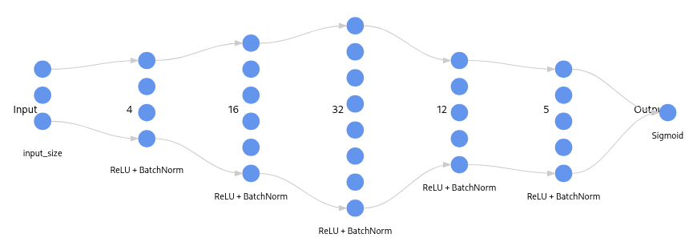

# Normalizacion por baches

Aunque no directamente implementado con este objectivo, es innegable que la [normalizacion por baches](https://arxiv.org/pdf/1502.03167) tiene un efecto regulador en el proceso de entrenamiento de modelos avanzados. Fue primeramente creado con el objetivo de estabilizar las distribuciones de las salidas de capas secuenciales en redes neuronales. A medida que la entrada se propaga hacia delante, su distribucion se desvia lo suficiente como para generar una discrepancia entre las normas de gradientes de capas secuenciales que imposibilita un entrenamiento uniforme a traves de toda la estructura. Es por esto que se creo la normalizacion por baches, para poder solucionar los cambios de distribucion repentinos a medida que se propaga la entrada.

Una muy buena lectura que insito al lector revisar es la siguiente: [Understanding Batch Normalization](https://arxiv.org/abs/1806.02375)

Esta explica de manera teorica y empirica el funcionamiento de la normalizacion por baches, las situaciones en las que es util, y mejores practicas, todo esto en bases experimentales. Pero en resumen, iniciando el entrenamiento las distribuciones de pesos estan definidas en un espacio muy propenso a generar "Exploding Gradients", o explosion de gradients al inicio del entramiento. Es asi que la primera solucion a esto es utilizar ratios de aprendizaje mas conservadores, estabilizando estas distribuciones, pero ralentizando el descenso de gradiente. Ahi es donde entra la normalizacion por baches, evita que la propagacion de las entradas cambien repentinamente su distribucion normalizando las salidas de cada capa.

## Formulacion matematica

La formulacion matematica se encuentra en el pdf: formulacionMatematica.pdf

